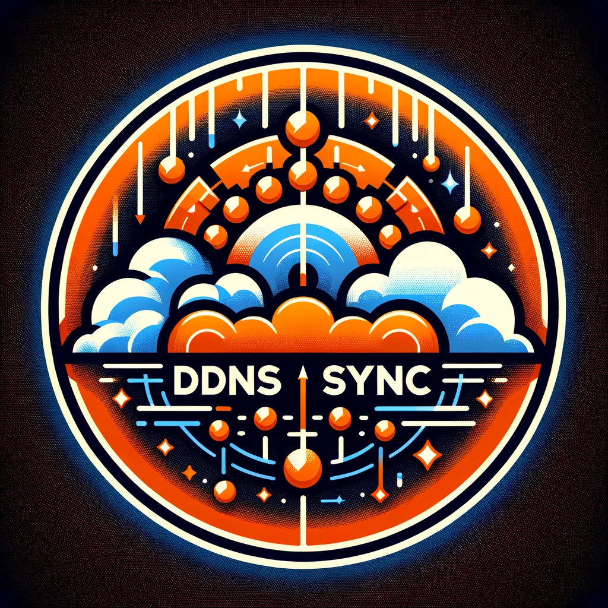

<table>
  <tr>
    <td width="25%"></td>
    <td><h1>Cloudflare DDNS Sync</h1></td>
  </tr>
</table>


[](https://www.npmjs.com/package/cloudflare-ddns-sync)
[](https://www.npmjs.com/package/cloudflare-ddns-sync)
[](https://www.npmjs.com/package/cloudflare-ddns-sync-cli)

## Overview

Cloudflare-DDNS-Sync is a simple module that updates Cloudflare DNS records.

For a more detailed overview, have a look at the [Documentation](https://cddnss.knaup.pw/)

You may also have a look at the **official** [CLI version](https://www.npmjs.com/package/cloudflare-ddns-sync-cli) of Cloudflare-DDNS-Sync.

## How do I set this project up?

### Prerequisites

- Node
- Cloudflare Account

### Installation

To install Cloudflare-DDNS-Sync simply run:

```
npm install cloudflare-ddns-sync
```

in your project folder.

## Usage

> Hint: If a record is not existing, CDS will automatically create it when
> syncing.

### Javascript Example

```javascript
const Cddnss = require('cloudflare-ddns-sync').default;

// either email and key or token
const cddnss = new Cddnss({
  email: 'your@email.com',
  key: '<your-cloudflare-api-key>',
  token: '<your-cloudflare-api-token>',
});

const records = [
  {
    name: 'test-1.domain.com',
    type: 'A', // optional
    proxied: true, // optional
    ttl: 1, // optional
    priority: 0, // optional
    content: '1.2.3.4', // optional
  },
  {
    name: 'test-2.domain.com',
  },
];

cddnss.syncRecords(records).then((result) => {
  console.log(result);
});
```

### Typescript Example

```typescript
import Cddnss, {Record, RecordData} from 'cloudflare-ddns-sync';

// either email and key or token
const cddnss = new Cddnss({
  email: 'your@email.com',
  key: '<your-cloudflare-api-key>',
  token: '<your-cloudflare-api-token>',
});

const records: Array<Record> = [
  {
    name: 'test-1.yourdomain.com',
    type: 'A', // optional
    proxied: true, // optional
    ttl: 1, // optional
    priority: 0, // optional
    content: '1.2.3.4', // optional
  },
  {
    name: 'test-2.yourdomain.com',
  },
];

cddnss.syncRecords(records).then((result: Array<RecordData>) => {
  console.log(result);
});
```

### Cron Expression Syntax

Cron expressions have the following syntax:

```
* * * * * *
┬ ┬ ┬ ┬ ┬ ┬
│ │ │ │ │ │
│ │ │ │ │ └──── weekday (0-7, sunday is 0 or 7)
│ │ │ │ └────── month (1-12)
│ │ │ └──────── day (1-31)
│ │ └────────── hour (0-23)
│ └──────────── minute (0-59)
└────────────── second (0-59) [optional]
```

## Methods

- getIp(): Promise\<string\>
- getIpv6(): Promise\<string\>
- getRecordDataForDomain(domain: string): Promise\<Array\<[RecordData](https://cddnss.knaup.pw/types/recorddata)\>\>
- getRecordDataForDomains(domains: Array\<string\>): Promise\<[DomainRecordList](https://cddnss.knaup.pw/types/domainrecordlist)\>
- getRecordDataForRecord(record: [Record](https://cddnss.knaup.pw/types/record)): Promise\<[RecordData](https://cddnss.knaup.pw/types/recorddata)\>
- getRecordDataForRecords(records: Array\<[Record](https://cddnss.knaup.pw/types/record)\>): Promise\<Array\<[RecordData](https://cddnss.knaup.pw/types/recorddata)\>\>
- removeRecord(recordName: string, recordType?: string): Promise\<void\>
- stopSyncOnIpChange(changeListenerId: string): void
- syncByCronTime(cronExpression: string, records: Array\<[Record](https://cddnss.knaup.pw/types/recorddata)\>, callback: [MultiSyncCallback](https://cddnss.knaup.pw/types/multisynccallback), ip?: string): [ScheduledTask](https://www.npmjs.com/package/node-cron#scheduledtask-methods)
- syncOnIpChange(records: Array\<[Record](https://cddnss.knaup.pw/types/record)\>, callback: multisynccallback): Promise\<string\>
- syncRecord(record: [Record](https://cddnss.knaup.pw/types/record), ip?: string): Promise\<[RecordData](https://cddnss.knaup.pw/types/recorddata)\>
- syncRecords(records: Array\<[Record](https://cddnss.knaup.pw/types/record)\>, ip?: string): Promise\<Array\<[RecordData](https://cddnss.knaup.pw/types/recorddata)\>\>

For a more detailed view, have a look at the [Documentation](https://cddnss.knaup.pw/)

## Get Your Cloudflare API Key

- Go to **[Cloudflare](https://www.cloudflare.com)**
- **Log In**
- In the upper right corner: **click on the user icon**
- Go to **"My Profile"**
- In the "API Tokens"-Section: **click on the "View"-Button of the Global Key**
- **Enter your password** and **fill the captcha**
- **Copy the API Key**

## Tests

In order to run the tests there are two ways to do so

### Use `test-data.json`

- Open the `test-data.json` which can be found under `src/tests/test-service/`
- Configure the email, cloudflare api key and the domain
- Run `npm test`

### Use `npm test` Only

- Run `npm test -- --email="your@email.com" --key="your_cloudflare_api_key" --domain="yourdomain.com"`
